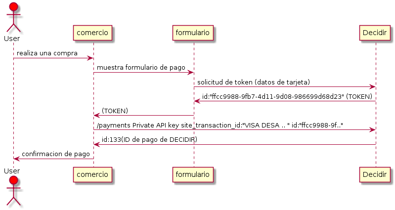

<a name="inicio"></a>
Decidir SDK Java
===============

Modulo para conexión con gateway de pago DECIDIR2
+ [Introducción](#introduccion)
  + [Alcance](#scope)
  + [Diagrama de secuencia](#secuencia)
+ [Instalación](#instalacion)
  + [Versiones de Java soportadas](#versionesdejavasoportadas)
  + [Ambientes](#environments)
+ [Uso](#uso)
  + [Inicializar la clase correspondiente al conector](#initconector)
  + [Operatoria del Gateway](#operatoria)
    + [Ejecución del Pago](#payment)
    + [Listado de Pagos](#getallpayments)
    + [Información de un Pago](#getpaymentinfo)
    + [Anulación / Devolución Total de Pago](#refund)
    + [Anulación de Devolución Total](#deleterefund)
    + [Devolución Parcial de un Pago](#partialrefund)
    + [Anulación de Devolución Parcial](#deletepartialrefund)
  + [Tokenización de tarjetas de crédito](#tokenizaciontarjeta)
    + [Listado de tarjetas tokenizadas](#listadotarjetastokenizadas)
    + [Ejecución de pago tokenizado](#pagotokenizado)
    + [Eliminación de tarjeta tokenizada](#eliminartarjetatokenizada)
  + [Integración con Cybersource](#cybersource)
    + [Parámetros Comunes](#parametros-comunes)
    + [Retail](#retail)
    + [Ticketing](#ticketing)
    + [Digital Goods](#digital-goods)
+ [Tablas de referencia](#tablasreferencia)
  + [Códigos de Medios de Pago](#codigos-de-medios-de-pago)
  + [Divisas Aceptadas](#divisasa)
  + [Provincias](#provincias)

<a name="introduccion"></a>
## Introducción
El flujo de una transacción a través de las **sdks** consta de dos pasos, la **generaci&oacute;n de un token de pago** por parte del cliente y el **procesamiento de pago** por parte del comercio. Existen sdks espec&iacute;ficas para realizar estas funciones en distintos lenguajes que se detallan a continuaci&oacute;n:

+ **Generaci&oacute;n de un token de pago.**  Se utiliza alguna de las siguentes **sdks front-end** :
  + [sdk IOS](https://github.com/decidir/SDK-IOS.v2)
  + [sdk Android](https://github.com/decidir/SDK-Android.v2)
  + [sdk Javascript](https://github.com/decidir/sdk-javascript-v2)
+ **Procesamiento de pago.**  Se utiliza alguna de las siguentes **sdks back-end** :
  + [sdk Java](https://github.com/decidir/SDK-JAVA.v2)
  + [sdk PHP](https://github.com/decidir/SDK-PHP.v2)
  + [sdk .Net](https://github.com/decidir/SDK-.NET.v2)
  + [sdk Node](https://github.com/decidir/SDK-.NODE.v2)

[<sub>Volver a inicio</sub>](#inicio)

<a name="scope"></a>
## Alcance
La **sdk Java** provee soporte para su **aplicaci&oacute;n back-end**, encargandose de la comunicaci&oacute;n del comercio con la **API Decidir** utilizando su **API Key privada**<sup>1</sup> y el **token de pago** generado por el cliente.

Para generar el token de pago, la aplicaci&oacute;n cliente realizar&aacute; con **Decidir** a trav&eacute;s de alguna de las siguentes **sdks front-end**:
+ [sdk IOS](https://github.com/decidir/SDK-IOS.v2)
+ [sdk Android](https://github.com/decidir/SDK-Android.v2)
+ [sdk Javascript](https://github.com/decidir/sdk-javascript-v2)

</br>

---
<sup>_1 - Las API Keys serán provistas por el equipo de Soporte de DECIDIR (soporte@decidir.com.ar). _</sup>

[<sub>Volver a inicio</sub>](#inicio)

<a name="secuencia"></a>

## Diagrama de secuencia
El flujo de una transacción a través de las **sdks** consta de dos pasos, a saber:

1. **sdk front-end:** Se realiza una solicitud de token de pago con la Llave de Acceso pública (public API Key), enviando los datos sensibles de la tarjeta (PAN, mes y año de expiración, código de seguridad, titular, y tipo y número de documento) y obteniéndose como resultado un token que permitirá realizar la transacción posterior.

2. **sdk back-end:** Se ejecuta el pago con la Llave de Acceso privada (private API Key), enviando el token generado en el Paso 1 más el identificador de la transacción a nivel comercio, el monto total, la moneda y la cantidad de cuotas.

A continuación, se presenta un diagrama con el Flujo de un Pago.

</br>

[<sub>Volver a inicio</sub>](#inicio)

<a name="instalacion"></a>
## Instalación
Se debe descargar la última versión del SDK desde el botón Download ZIP del branch master.
Una vez descargado y descomprimido, se debe agregar la librería `decidir.jar` que se encuentra dentro de la carpeta `./dist/`, a las librerías del proyecto y en el codigo se debe agregar siguiente import.

```java
import com.decidir.sdk.Decidir;
import com.decidir.sdk.dto.*;
import com.decidir.sdk.exceptions.*;
```

<a name="versionesdejavasoportadas"></a>
### Versiones de Java soportadas
La versi&oacute;n implementada de la SDK, est&aacute; testeada para versiones desde Java 1.7

[<sub>Volver a inicio</sub>](#inicio)

<a name="environments"></a>

## Ambientes

La **sdk Java** permite trabajar con los ambientes Sandbox y Producc&oacute;n de Decidir.
El ambiente se debe instanciar indicando su URL.

```java
import com.decidir.sdk.Decidir;

public class MiClase {
	String privateApiKey = "92b71cf711ca41f78362a7134f87ff65";//Private API Key habilitada para operar en ambiente Sandbox
	String urlSandbox = "https://developers.decidir.com/api/v1";
	String urlProduccion = "https://live.decidir.com/api/v1";
	int timeout = 10; // 10 segundos de timeout
	//Para el ambiente de desarrollo
	Decidir decidirSandbox = new Decidir(privateApiKey, urlSandbox, timeout);
	//Para el ambiente de produccion
	Decidir decidirProd = new Decidir(privateApiKey, urlProduccion, timeout);
	// ...codigo...
}
```
[<sub>Volver a inicio</sub>](#inicio)

<a name="uso"></a>
## Uso

<a name="initconector"></a>
### Inicializar la clase correspondiente al conector.

Instanciación de la clase `Decidir`

La misma recibe como parámetros la API Key privada provista por Decidir para el comercio y el ambiente en que se trabajara.

Las API Keys serán provistas por el equipo de Soporte de DECIDIR (soporte@decidir.com.ar).

A partir de ahora y por el resto de la documentaci&oacute;n, se ejemplificar&aacute; utilizando una APIKey habilitada para operar en el ambiente Sandbox.

```java
// ...codigo...
String privateApiKey = "92b71cf711ca41f78362a7134f87ff65";//Private API Key habilitada para operar en ambiente Sandbox
String urlSandbox = "https://developers.decidir.com/api/v1";
int timeout = 10; // 10 segundos de timeout
//Ejemplo para el ambiente Sandbox
Decidir decidir = new Decidir(privateApiKey, urlSandbox, timeout);
//...codigo...
```

[<sub>Volver a inicio</sub>](#inicio)

<a name="operatoria"></a>

## Operatoria del Gateway

<a name="payment"></a>

### Ejecución del Pago
Una vez generado y almacenado el token de pago, se deberá ejecutar la solicitud de pago más el token previamente generado.
Además del token de pago y los parámetros propios de la transacción, el comercio deberá identificar la compra con el site_transaction_id y el user_id.

*Aclaracion* : amount es un campo long el cual representa el valor en centavos.

```java
// ...codigo...
String privateApiKey = "92b71cf711ca41f78362a7134f87ff65";//Private API Key habilitada para operar en ambiente Sandbox
String urlSandbox = "https://developers.decidir.com/api/v1";
int timeout = 10; // 10 segundos de timeout
//Ejemplo para el ambiente Sandbox
Decidir decidir = new Decidir(privateApiKey, urlSandbox, timeout);

PaymentNoPciRequest paymentRequest = new PaymentNoPciRequest();
paymentRequest.setToken("ae9fc3e5-ff41-4de2-9c91-81030be1c4a6"); // token de pago
paymentRequest.setSite_transaction_id("TX00001234"); //ID de transaccion asignada por el comercio, no puede repetirse
paymentRequest.setUser_id("test");
paymentRequest.setPayment_method_id(1); //VISA
paymentRequest.setBin("450799");
paymentRequest.setAmount(23250L);//Valor en centavos: $232.50
paymentRequest.setCurrency(Currency.ARS);
paymentRequest.setInstallments(1);
paymentRequest.setPayment_type(PaymentType.SINGLE);
List<SubPayment> sub_payments = new ArrayList<SubPayment>() // Llenar en caso de transaccion distribuida
paymentRequest.setSub_payments(sub_payments);

try {
	DecidirResponse<PaymentResponse> paymentResponse = decidir.payment(paymentRequest);
	// Procesamiento de respuesta de ejecucion de pago
	// ...codigo...
} catch (PaymentException pe) {
	 // Manejo de pago rechazado
	 // ...codigo...
} catch (DecidirException de) {
	// Manejo de excepcion  de Decidir
	 // ...codigo...
} catch (Exception e) {
	 //Manejo de excepcion general
	// ...codigo...
}
// ...codigo...
```

[<sub>Volver a inicio</sub>](#inicio)

<a name="getallpayments"></a>

### Listado de Pagos

Mediante este recurso, se genera una solicitud de listado de pagos.
Este recurso admite la posibilidad de agregar filtros adicionales

```java
// ...codigo...
String privateApiKey = "92b71cf711ca41f78362a7134f87ff65";//Private API Key habilitada para operar en ambiente Sandbox
String urlSandbox = "https://developers.decidir.com/api/v1";
int timeout = 10; // 10 segundos de timeout
//Ejemplo para el ambiente Sandbox
Decidir decidir = new Decidir(privateApiKey, urlSandbox, timeout);

Integer offset = 20;//OPCIONAL, desplazamiento en los resultados devueltos. Valor por defecto = 0.
Integer pageSize = 10; //OPCIONAL, cantidad máxima de resultados retornados. Valor por defecto = 50.
String siteOperationId = null; //OPCIONAL, ID único de la transacción a nivel comercio (equivalente al site_transaction_id).
String sitetId = null;//OPCIONAl, ID Site del comercio.

try {
	DecidirResponse<Page> pagos = decidir.getPayments(offset, pageSize, siteOperationId, siteId);
	// Procesamiento de respuesta de listado de pagos
	// ...codigo...
} catch (DecidirException de) {
	// Manejo de excepcion  de Decidir
	 // ...codigo...
} catch (Exception e) {
	 //Manejo de excepcion general
	// ...codigo...
}
// ...codigo...
```

[<sub>Volver a inicio</sub>](#inicio)

<a name="getpaymentinfo"></a>

### Información de un Pago

Mediante este recurso, se genera una solicitud de información de un pago previamente realizado, pasando como parámetro el id del pago.

```java
// ...codigo...
String privateApiKey = "92b71cf711ca41f78362a7134f87ff65";//Private API Key habilitada para operar en ambiente Sandbox
String urlSandbox = "https://developers.decidir.com/api/v1";
int timeout = 10; // 10 segundos de timeout
//Ejemplo para el ambiente Sandbox
Decidir decidir = new Decidir(privateApiKey, urlSandbox, timeout);

long idPago = 000123L; //ID devuelto por la operacion de pago (NO CONFUNDIR con site_transaction_id asignado por el comercio)
try {
	DecidirResponse<PaymentResponse> pago = decidir.getPayment(idPago);
	// Procesamiento de respuesta de consulta de pago
	// ...codigo...
} catch (DecidirException de) {
	// Manejo de excepcion  de Decidir
	 // ...codigo...
} catch (Exception e) {
	 //Manejo de excepcion general
	// ...codigo...
}
// ...codigo...
```

[<sub>Volver a inicio</sub>](#inicio)

<a name="refund"></a>

### Anulación / Devolución Total de Pago

Mediante este recurso, se genera una solicitud de anulación / devolución total de un pago puntual, pasando como parámetro el id del pago y el usuario del cliente.

```java
// ...codigo...
String privateApiKey = "92b71cf711ca41f78362a7134f87ff65";//Private API Key habilitada para operar en ambiente Sandbox
String urlSandbox = "https://developers.decidir.com/api/v1";
int timeout = 10; // 10 segundos de timeout
//Ejemplo para el ambiente Sandbox
Decidir decidir = new Decidir(privateApiKey, urlSandbox, timeout);
long idPago = 000123L; //ID devuelto por la operacion de pago (NO CONFUNDIR con site_transaction_id asignado por el comercio)
String usuario = "usuario_que_realiza_la_accion"; //Usuario habilitado para realizar la anulacion/devolucion. Se utiliza para matener un registro de quien realiza la operacion
RefundPayment refundPayment = new RefundPayment(); //Se instancia sin datos
try {
	DecidirResponse<RefundPaymentResponse> devolucion = decidir. refundPayment(idPago, refundPayment, usuario)
	// Procesamiento de respuesta de la devolucion de pago
	// ...codigo...
} catch (DecidirException de) {
	// Manejo de excepcion  de Decidir
	 // ...codigo...
} catch (Exception e) {
	 //Manejo de excepcion general
	// ...codigo...
}
// ...codigo...
```
[<sub>Volver a inicio</sub>](#inicio)

<a name="deleterefund"></a>

### Anulación de Devolución Total

Mediante este recurso, se genera una solicitud de anulación de devolución total de un pago puntual, pasando como parámetro el id del pago, el id de la devolución y el usuario del cliente.
```java
// ...codigo...
String privateApiKey = "92b71cf711ca41f78362a7134f87ff65";//Private API Key habilitada para operar en ambiente Sandbox
String urlSandbox = "https://developers.decidir.com/api/v1";
int timeout = 10; // 10 segundos de timeout
//Ejemplo para el ambiente Sandbox
Decidir decidir = new Decidir(privateApiKey, urlSandbox, timeout);
long idPago = 000123L;//ID devuelto por la operacion de pago (NO CONFUNDIR con site_transaction_id asignado por el comercio)
long idDevolucion = 00012L;//ID devuelto por la operacion de devolucion
String usuario = "usuario_que_realiza_la_accion"; //Usuario habilitado para realizar la anulacion/devolucion. Se utiliza para matener un registro de quien realiza la operacion

try {
	DecidirResponse<AnnulRefundResponse> anulacion = decidir. cancelRefund(idPago, idDevolucion, usuario)
	// Procesamiento de respuesta de anulacion de devolucion
	// ...codigo...
} catch (DecidirException de) {
	// Manejo de excepcion  de Decidir
	 // ...codigo...
} catch (Exception e) {
	 //Manejo de excepcion general
	// ...codigo...
}
// ...codigo...
```
[<sub>Volver a inicio</sub>](#inicio)

<a name="partialrefund"></a>

### Devolución Parcial de un Pago

Mediante este recurso, se genera una solicitud de devolución parcial de un pago puntual, pasando como parámetro el id del pago, el monto de la devolución y el usuario del cliente.

```java
// ...codigo...
String privateApiKey = "92b71cf711ca41f78362a7134f87ff65";//Private API Key habilitada para operar en ambiente Sandbox
String urlSandbox = "https://developers.decidir.com/api/v1";
int timeout = 10; // 10 segundos de timeout
//Ejemplo para el ambiente Sandbox
Decidir decidir = new Decidir(privateApiKey, urlSandbox, timeout);
long idPago = 000123L; //ID devuelto por la operacion de pago (NO CONFUNDIR con site_transaction_id asignado por el comercio)
String usuario = "usuario_que_realiza_la_accion"; //Usuario habilitado para realizar la anulacion/devolucion. Se utiliza para matener un registro de quien realiza la operacion
long  montoDevolucion = 1250L // Expresado en centavos

RefundPayment refundPayment = new RefundPayment();
refundPayment.setAmount(montoDevolucion);
refundPayment.setSub_payments(new ArrayList<RefundSubPayment>());//Llenar en caso de solicitar devolucion parcial en transaccion distribuida
try {
	DecidirResponse<RefundPaymentResponse> devolucion = decidir.refundPayment(idPago, refundPayment, usuario)
	// Procesamiento de respuesta de la devolucion de pago
	// ...codigo...
} catch (DecidirException de) {
	// Manejo de excepcion  de Decidir
	 // ...codigo...
} catch (Exception e) {
	 //Manejo de excepcion general
	// ...codigo...
}
// ...codigo...
```

[<sub>Volver a inicio</sub>](#inicio)

<a name="deletepartialrefund"></a>

### Anulación de Devolución Parcial

Mediante este recurso, se genera una solicitud de anulación de devolución parcial de un pago puntual, pasando como parámetro el id del pago, el id de la devolución  el usuario del cliente.
```java
// ...codigo...
String privateApiKey = "92b71cf711ca41f78362a7134f87ff65";//Private API Key habilitada para operar en ambiente Sandbox
String urlSandbox = "https://developers.decidir.com/api/v1";
int timeout = 10; // 10 segundos de timeout
//Ejemplo para el ambiente Sandbox
Decidir decidir = new Decidir(privateApiKey, urlSandbox, timeout);
long idPago = 000123L;//ID devuelto por la operacion de pago (NO CONFUNDIR con site_transaction_id asignado por el comercio)
long idDevolucion = 00012L;//ID devuelto por la operacion de devolucion
String usuario = "usuario_que_realiza_la_accion"; //Usuario habilitado para realizar la anulacion/devolucion. Se utiliza para matener un registro de quien realiza la operacion
try {
	DecidirResponse<AnnulRefundResponse> anulacion = decidir.cancelRefund(idPago, idDevolucion, usuario)
	// Procesamiento de respuesta de anulacion de devolucion
	// ...codigo...
} catch (DecidirException de) {
	// Manejo de excepcion  de Decidir
	 // ...codigo...
} catch (Exception e) {
	 //Manejo de excepcion general
	// ...codigo...
}
// ...codigo...
```
[<sub>Volver a inicio</sub>](#inicio)

<a name="tokenizaciontarjeta"></a>

## Tokenización de tarjetas de crédito

Esta funcionalidad permite que luego de realizar una compra con una tarjeta, se genere un token alfanumerico unico en el backend de Decidir, esto permite que a la hora de comprar nuevamente con esta tarjeta solo requerira el codigo de seguridad.
Como primer paso se debe realizar una un pago normal, el token generado estara en el campo "token" de la respuesta.

[<sub>Volver a inicio</sub>](#inicio)

<a name="listadotarjetastokenizadas"></a>

### Listado de tarjetas tokenizadas

Este método permite conocer el listado de tarjetas tokenizadas que posee un usuario determinado. Para esto es necesario el nombre de usuario a la instancia de token.
Este recurso admite la posibilidad de agregar filtros adicionales.


```java
// ...codigo...
String privateApiKey = "92b71cf711ca41f78362a7134f87ff65";//Private API Key habilitada para operar en ambiente Sandbox
String urlSandbox = "https://developers.decidir.com/api/v1";
int timeout = 10; // 10 segundos de timeout
//Ejemplo para el ambiente Sandbox
Decidir decidir = new Decidir(privateApiKey, urlSandbox, timeout);

String usuario = "usuario_cliente"; // Usuario para el cual se consultan las tarjetas tokenizadas
String bin = "450799"; //OPCIONAL, bin de la tarjeta.
String ultimosCuatroDigitos = null; //OPCIONAL, ultimos 4 digitos de la tarjeta.
String mesVencimiento = null; //OPCIONAL, mes de vencimiento de la tarjeta.
String anioVencimiento = "18"; //OPCIONAL, año de vencimiento de la tarjeta.

try {
	DecidirResponse<CardTokens> tarjetasTokenizadas = decidir.getCardTokens(usuario, bin, ultimosCuatroDigitos, mesVencimiento, anioVencimiento);
	// Procesamiento de respuesta de listado de tarjetas tokenizadas
	// ...codigo...
} catch (DecidirException de) {
	// Manejo de excepcion  de Decidir
	 // ...codigo...
} catch (Exception e) {
	 //Manejo de excepcion general
	// ...codigo...
}
// ...codigo...
```

[<sub>Volver a inicio</sub>](#inicio)

<a name="pagotokenizado"></a>

### Ejecución de pago tokenizado

Una vez que se obtiene el token a partir de la tarjeta tokenizada, se deberá ejecutar la solicitud de pago. Además del token de pago y los parámetros propios de la transacción, el comercio deberá identificar la compra con el "site_transaction_id" y "user_id".

*Aclaracion* : amount es un campo long el cual representa el valor en centavos.

```java
// ...codigo...
String privateApiKey = "92b71cf711ca41f78362a7134f87ff65";//Private API Key habilitada para operar en ambiente Sandbox
String urlSandbox = "https://developers.decidir.com/api/v1";
int timeout = 10; // 10 segundos de timeout
//Ejemplo para el ambiente Sandbox
Decidir decidir = new Decidir(privateApiKey, urlSandbox, timeout);

PaymentNoPciRequest paymentRequest = new PaymentNoPciRequest();
paymentRequest.setToken("ae9fc3e5-ff41-4de2-9c91-81030be1c4a6"); // token de pago
paymentRequest.setSite_transaction_id("0001234");
paymentRequest.setUser_id("test");
paymentRequest.setPayment_method_id(1); //MASTERCARD
paymentRequest.setBin("45079");
paymentRequest.setAmount(23250L);//Valor en centavos: $232.50
paymentRequest.setCurrency(Currency.ARS);
paymentRequest.setInstallments(1);
paymentRequest.setPayment_type(PaymentType.SINGLE);
List<SubPayment> sub_payments = new ArrayList<SubPayment>() // Llenar en caso de transaccion distribuida
paymentRequest.setSub_payments(sub_payments);

try {
	DecidirResponse<PaymentResponse> paymentResponse = decidir.payment(paymentRequest);
	// Procesamiento de respuesta de ejecucion de pago
	// ...codigo...
} catch (PaymentException pe) {
	 // Manejo de pago rechazado
	 // ...codigo...
} catch (DecidirException de) {
	// Manejo de excepcion  de Decidir
	 // ...codigo...
} catch (Exception e) {
	 //Manejo de excepcion general
	// ...codigo...
}
// ...codigo...
```

[<sub>Volver a inicio</sub>](#inicio)

<a name="eliminartarjetatokenizada"></a>

### Eliminación de tarjeta tokenizada

El servicio da la posibilidad de eliminar un token de tarjeta generadas, esto se logra instanciando token y utilizando el método DeleteCardToken(token). Funciona enviando la tarjeta tokenizada.

```java
// ...codigo...
String privateApiKey = "92b71cf711ca41f78362a7134f87ff65";//Private API Key habilitada para operar en ambiente Sandbox
String urlSandbox = "https://developers.decidir.com/api/v1";
int timeout = 10; // 10 segundos de timeout
//Ejemplo para el ambiente Sandbox
Decidir decidir = new Decidir(privateApiKey, urlSandbox, timeout);
try {
	DecidirResponse<Void> respuesta = decidir.deleteCardToken("ae9fc3e5-ff41-4de2-9c91-81030be1c4a6");
	// Procesamiento de respuesta de eliminacion de tarjeta tokenizada
	// ...codigo...
} catch (DecidirException de) {
	// Manejo de excepcion  de Decidir
	 // ...codigo...
} catch (Exception e) {
	 //Manejo de excepcion general
	// ...codigo...
}
// ...codigo...
```
[<sub>Volver a inicio</sub>](#inicio)

<a name="cybersource"></a>

## Integración con Cybersource

Para utilizar el Servicio de Control de Fraude Cybersource, en la operación SendAuthorizeRequest, deben enviarse datos adicionales sobre la operación de compra que se quiere realizar.
Se han definido cinco verticales de negocio que requieren parámetros específicos, así como también parámetros comunes a todas las verticales.

[<sub>Volver a inicio</sub>](#inicio)

<a name="parametros-comunes"></a>

### Parámetros Comunes

Los parámetros comunes a todas las verticales deben enviarse junto con los datos específicos de cada uno. A continuación, describiremos los párametros comúnes que se deberan agregar a los datos de cada vertical al momento de instanciar la clase correspondiente.

1.  **bill_to**
```java
// ...codigo...
BillingData billTo = new BillingData();
billTo.setCity("Buenos Aires"); //Ciudad de facturación, MANDATORIO.
billTo.setCountry("AR"); //País de facturación. MANDATORIO. Código ISO. (http://apps.cybersource.com/library/documentation/sbc/quickref/countries_alpha_list.pdf)
billTo.setCustomer_id("test");//Identificador del usuario al que se le emite la factura. MANDATORIO. No puede contener un correo electrónico.
billTo.setEmail("usuario@email.com.ar");//Mail del usuario al que se le emite la factura. MANDATORIO.
billTo.setFirst_name("Usuario"); //Nombre del usuario al que se le emite la factura. MANDATORIO.
billTo.setLast_name("Prueba");//Apellido del usuario al que se le emite la factura. MANDATORIO.
billTo.setPhone_number("54116763329");//Teléfono del usuario al que se le emite la factura. No utilizar guiones, puntos o espacios. Incluir código de país. MANDATORIO.
billTo.setPostal_code("1414");//Código Postal de la dirección de facturación. MANDATORIO.
billTo.setState("C");//Provincia de la dirección de facturación. MANDATORIO. Ver tabla anexa de provincias.
billTo.setStreet1("THAMES 677");//Domicilio de facturación (calle y nro). MANDATORIO.
billTo.setStreet2("4to F");//Complemento del domicilio. (piso, departamento). OPCIONAL.
fraudDetectionData.setBill_to(billTo); //Subclase de com.decidir.sdk.dto.FraudDetectionDataRequest
// ...codigo...
```
2.  **purchase_totals**
```java
// ...codigo...
PurchaseTotals purchaseTotals = new PurchaseTotals();
purchaseTotals.setCurrency(Currency.ARS); //com.decidir.sdk.dto.Currency. MANDATORIO.
purchaseTotals.setAmount(34900);//Monto en centavos. MANDATORIO.
fraudDetectionData.setPurchase_totals(purchaseTotals); //Subclase de com.decidir.sdk.dto.FraudDetectionDataRequest
// ...codigo...
```

3. **customer_in_site**
```java
// ...codigo...
CustomerInSite customerInSite = new CustomerInSite();
customerInSite.setDays_in_site(243);
customerInSite.setIs_guest(Boolean.FALSE);
customerInSite.setPassword("abracadabra");
customerInSite.setNum_of_transactions(1);
customerInSite.setCellphone_number("1546763329");
fraudDetectionData.setCustomer_in_site(customerInSite); //Subclase de com.decidir.sdk.dto.FraudDetectionDataRequest
// ...codigo...
```
4.  **copy_paste_card_data**
```java
// ...codigo...
CopyPasteCardData copyPasteCardData = new CopyPasteCardData();
copyPasteCardData.setCard_number("4507990000004905");
copyPasteCardData.setSecurity_code("123");
fraudDetectionData.setCopy_paste_card_data(copyPasteCardData);//Subclase de com.decidir.sdk.dto.FraudDetectionDataRequest
// ...codigo...
```
5.  _**Otros campos**_
```java
// ...codigo...
fraudDetectionData.setChannel(Channel.WEB);
fraudDetectionData.setDispatch_method("domicilio");//{domicilio, click and collect, courrier}
fraudDetectionData.setSend_to_cs(Boolean.true);// true o false
fraudDetectionData.setDevice_unique_id("fingerprint-del-cliente");//Subclase de com.decidir.sdk.dto.FraudDetectionDataRequest
// ...codigo...
```

[<sub>Volver a inicio</sub>](#inicio)

<a name="retail"></a>

### Retail
Se enviá un `RetailFraudDetectionData` con los [parámetros comunes](#parametros-comunes) y con los siguientes parámetros que se deben enviar específicamente para la vertical Retail. Además se deben enviar datos específicos de cada producto involucrado en la transacción.

```java
// ...codigo...
RetailFraudDetectionData retail =  new RetailFraudDetectionData();
//seteo de parámetros comunes
// ...codigo...
RetailTransactionData retailTransactionData = new RetailTransactionData();//Datos para la vertical Retail
//Datos de envio
ShippingData shipTo = new ShippingData();
shipTo.setCity("Buenos Aires"); //Ciudad de envío, MANDATORIO.
shipTo.setCountry("AR"); //País de envío. MANDATORIO. Código ISO. (http://apps.cybersource.com/library/documentation/sbc/quickref/countries_alpha_list.pdf)
shipTo.setEmail("usuario@email.com.ar");//Mail del destinatario. MANDATORIO.
shipTo.setFirst_name("Usuario"); //Nombre del destinatario. MANDATORIO.
shipTo.setLast_name("Prueba");//Apellido del destinatario. MANDATORIO.
shipTo.setPhone_number("54116763329");//Teléfono del destinatario. No utilizar guiones, puntos o espacios. Incluir código de país. MANDATORIO.
shipTo.setPostal_code("1414");//Código Postal de la dirección de envío. MANDATORIO.
shipTo.setState("C");//Provincia de la dirección de envío. MANDATORIO. Ver tabla anexa de provincias.
shipTo.setStreet1("THAMES 677");//Domicilio de envío (calle y nro). MANDATORIO.
shipTo.setStreet2("4to F");//Complemento del domicilio. (piso, departamento). OPCIONAL.
retailTransactionData.setShip_to(shipTo);//Datos de envio. MANDATORIO
retailTransactionData.setDays_to_delivery("2");
retailTransactionData.setTax_voucher_required(Boolean.TRUE);
retailTransactionData.setCustomer_loyality_number("123232");
setCoupon_code("cupon22");
//Items de compra (Al menos un item)
Item item = new Item();
item.setCode("popblacksabbat2016");  //MANDATORIO
item.setDescription("Popular Black Sabbath 2016"); //OPCIONAL
item.setName("popblacksabbat2016ss");//MANDATORIO
item.setSku("sku");//MANDATORIO
item.setTotal_amount(34900);//MANDATORIO
item.setQuantity(1);//MANDATORIO
item.setUnit_price(34900);//MANDATORIO
ticketingTransactionData.setItems(Arrays.asList(item); //Items de compra. MANDATORIO
retail.setRetail_transaction_data(retailTransactionData);//Datos de vertical Retail. MANDATORIO
// ...codigo...
```

Para incorporar estos datos en el requerimiento inicial, se debe instanciar un objeto de la clase `RetailFraudDetectionData` de la siguiente manera.

```java
// ...codigo...
String privateApiKey = "92b71cf711ca41f78362a7134f87ff65";//Private API Key habilitada para operar en ambiente Sandbox
String urlSandbox = "https://developers.decidir.com/api/v1";
int timeout = 10; // 10 segundos de timeout
//Ejemplo para el ambiente Sandbox
Decidir decidir = new Decidir(privateApiKey, urlSandbox, timeout);
PaymentNoPciRequest paymentRequest = new PaymentNoPciRequest();
// Datos del pago
 // ...codigo...
 RetailFraudDetectionData retail =  new RetailFraudDetectionData();
//Datos de vertical Retail
// ...codigo...
paymentRequest.setFraud_detection(retail);
try {
	DecidirResponse<PaymentResponse> paymentResponse = decidir.payment(paymentRequest);
	// Procesamiento de respuesta de ejecucion de pago
	// ...codigo...
} catch (PaymentException pe) {
	 // Manejo de pago rechazado
	 // ...codigo...
} catch (DecidirException de) {
	// Manejo de excepcion  de Decidir
	 // ...codigo...
} catch (Exception e) {
	 //Manejo de excepcion general
	// ...codigo...
}
// ...codigo...
```

[<sub>Volver a inicio</sub>](#inicio)

<a name="ticketing"></a>

### Ticketing

Se enviá un `TicketingTransactionData` con los [parámetros comunes](#parametros-comunes) y con los siguientes parámetros que se deben enviar específicamente para la vertical Ticketing. Además se deben enviar datos específicos de cada producto involucrado en la transacción.

```java
// ...codigo...
TicketingTransactionData ticketing =  new TicketingTransactionData();
//seteo de parámetros comunes
// ...codigo...
TicketingTransactionData ticketingTransactionData = new TicketingTransactionData();//Datos para la vertical Ticketing

ticketingTransactionData.setDays_to_event(10);   //MANDATORIO
ticketingTransactionData.setDelivery_type("Pick up");  //MANDATORIO
//Items de compra (Al menos un item)
Item item = new Item();
item.setCode("popblacksabbat2016");  //MANDATORIO
item.setDescription("Popular Black Sabbath 2016"); //OPCIONAL
item.setName("popblacksabbat2016ss");//MANDATORIO
item.setSku("sku");//MANDATORIO
item.setTotal_amount(34900);//MANDATORIO
item.setQuantity(1);//MANDATORIO
item.setUnit_price(34900);//MANDATORIO
ticketingTransactionData.setItems(Arrays.asList(item); //Items de compra. MANDATORIO
ticketing.setTicketing_transaction_data(ticketingTransactionData);//Datos de vertical Ticketing. MANDATORIO
// ...codigo...
```

Para incorporar estos datos en el requerimiento inicial, se debe instanciar un objeto de la clase`TicketingTransactionData`  de la siguiente manera.

```java
// ...codigo...
String privateApiKey = "92b71cf711ca41f78362a7134f87ff65";//Private API Key habilitada para operar en ambiente Sandbox
String urlSandbox = "https://developers.decidir.com/api/v1";
int timeout = 10; // 10 segundos de timeout
//Ejemplo para el ambiente Sandbox
Decidir decidir = new Decidir(privateApiKey, urlSandbox, timeout);

PaymentNoPciRequest paymentRequest = new PaymentNoPciRequest();
// Datos del pago
 // ...codigo...
TicketingTransactionData ticketing =  new TicketingTransactionData();
//Datos de vertical Ticketing
// ...codigo...
paymentRequest.setFraud_detection(ticketing);
try {
	DecidirResponse<PaymentResponse> paymentResponse = decidir.payment(paymentRequest);
	// Procesamiento de respuesta de ejecucion de pago
	// ...codigo...
} catch (PaymentException pe) {
	 // Manejo de pago rechazado
	 // ...codigo...
} catch (DecidirException de) {
	// Manejo de excepcion  de Decidir
	 // ...codigo...
} catch (Exception e) {
	 //Manejo de excepcion general
	// ...codigo...
}
// ...codigo...
```

[<sub>Volver a inicio</sub>](#inicio)

<a name="digital-goods"></a>

### Digital Goods

Se enviá un `DigitalGoodsFraudDetectionData` con los [parámetros comunes](#parametros-comunes) y con los siguientes parámetros que se deben enviar específicamente para la vertical Digital Goods. Además se deben enviar datos específicos de cada producto involucrado en la transacción.

```java
// ...codigo...
DigitalGoodsFraudDetectionData digitalGoods =  new DigitalGoodsFraudDetectionData();
//seteo de parámetros comunes
// ...codigo...
DigitalGoodsTransactionData digitalGoodsTransactionData = new DigitalGoodsTransactionData();//Datos para la vertical Digital Goods

digitalGoodsTransactionData.setDelivery_type("Pick up");  //MANDATORIO
//Items de compra (Al menos un item)
Item item = new Item();
item.setCode("popblacksabbat2016");  //MANDATORIO
item.setDescription("Popular Black Sabbath 2016"); //OPCIONAL
item.setName("popblacksabbat2016ss");//MANDATORIO
item.setSku("sku");//MANDATORIO
item.setTotal_amount(34900);//MANDATORIO
item.setQuantity(1);//MANDATORIO
item.setUnit_price(34900);//MANDATORIO
digitalGoodsTransactionData.setItems(Arrays.asList(item); //Items de compra. MANDATORIO
digitalGoods.setDigital_goods_transaction_data(digitalGoodsTransactionData);//Datos de vertical Digital Goods. MANDATORIO
// ...codigo...
```

Para incorporar estos datos en el requerimiento inicial, se debe instanciar un objeto de la clase`DigitalGoodsFraudDetectionData`  de la siguiente manera.

```java
// ...codigo...
String privateApiKey = "92b71cf711ca41f78362a7134f87ff65";//Private API Key habilitada para operar en ambiente Sandbox
String urlSandbox = "https://developers.decidir.com/api/v1";
int timeout = 10; // 10 segundos de timeout
//Ejemplo para el ambiente Sandbox
Decidir decidir = new Decidir(privateApiKey, urlSandbox, timeout);

PaymentNoPciRequest paymentRequest = new PaymentNoPciRequest();
// Datos del pago
 // ...codigo...
DigitalGoodsFraudDetectionData digitalGoods=  new DigitalGoodsFraudDetectionData();
//Datos de vertical Digital Goods
// ...codigo...
paymentRequest.setFraud_detection(digitalGoods);
try {
	DecidirResponse<PaymentResponse> paymentResponse = decidir.payment(paymentRequest);
	// Procesamiento de respuesta de ejecucion de pago
	// ...codigo...
} catch (PaymentException pe) {
	 // Manejo de pago rechazado
	 // ...codigo...
} catch (DecidirException de) {
	// Manejo de excepcion  de Decidir
	 // ...codigo...
} catch (Exception e) {
	 //Manejo de excepcion general
	// ...codigo...
}
// ...codigo...
```

[<sub>Volver a inicio</sub>](#inicio)

<a name="tablasreferencia"></a>

## Tablas de Referencia

<a name="codigos-de-medios-de-pago"></a>

### Códigos de Medios de pago

| MEDIO DE PAGO | NOMBRE |
----------------|--------
| 1 | VISA |
| 8 | DINERS |
| 15 | MASTERCARD |
| 20 | MASTERCARD TEST |
| 23 | TARJETA SHOPPING |
| 24 | TARJETA NARANJA |
| 25 | PAGO FACIL |
| 26 | RAPIPAGO |
| 27 | CABAL |
| 29 | ITALCRED |
| 30 | ARGENCARD |
| 31 | VISA DEBITO<sup>1</sup> |
| 34 | COOPEPLUS |
| 36 | ARCASH |
| 37 | NEXO |
| 38 | CREDIMAS |
| 39 | TARJETA NEVADA |
| 41 | PAGOMISCUENTAS |
| 42 | NATIVA |
| 43 | TARJETA MAS |
| 44 | TARJETA CARREFOUR |
| 45 | TARJETA PYMENACION |
| 46 | PAYSAFECARD |
| 47 | MONEDERO ONLINE |
| 48 | CAJA DE PAGOS |
| 50 | BBPS |
| 51 | COBRO EXPRESS |
| 52 | QIDA |
| 53 | LAPOS WEB TRAVEL |
| 54 | GRUPAR |
| 55 | PATAGONIA 365 |
| 56 | TARJETA CLUD DIA |
| 59 | TARJETA TUYA |
| 60 | DISTRIBUTION |
| 61 | LA ANONIMA |
| 62 | CREDIGUIA |
| 63 | CABAL PRISMA |
| 64 | TARJETA SOL |
| 65 | AMEX |
| 66 | MC DEBIT |
| 67 | CABAL DEBITO (Cabal24) |
| 99 | MAESTRO |

1. Visa Debito no acepta devoluciones parciales en ecommerce.

[<sub>Volver a inicio</sub>](#inicio)

<a name="divisasa"></a>

### Divisas Aceptadas

| Divisa | Descripción | Código API
---------|-------------|--------
| AR$ | Pesos Argentinos | ARS
| U$S | Dólares Americanos | USD

**NOTA** Si bien la API RESTful de DECIDIR admite compras en Dólares Americanos, la legislación argentina sólo permite transacciones en Pesos Argentinos. Es por esto que DECIDIR recomienda que todas las transacciones se cursen en dicha moneda.

[<sub>Volver a inicio</sub>](#inicio)

<a name="provincias"></a>

### Provincias

| Provincia | Código |
|----------|-------------|
| CABA | C |
| Buenos Aires | B |
| Catamarca | K |
| Chaco | H |
| Chubut | U |
| Córdoba | X |
| Corrientes | W |
| Entre Ríos | R |
| Formosa | P |
| Jujuy | Y |
| La Pampa | L |
| La Rioja | F |
| Mendoza | M |
| Misiones | N |
| Neuquén | Q |
| Río Negro | R |
| Salta | A |
| San Juan | J |
| San Luis | D |
| Santa Cruz | Z |
| Santa Fe | S |
| Santiago del Estero | G |
| Tierra del Fuego | V |
| Tucumán | T |

[<sub>Volver a inicio</sub>](#inicio)
